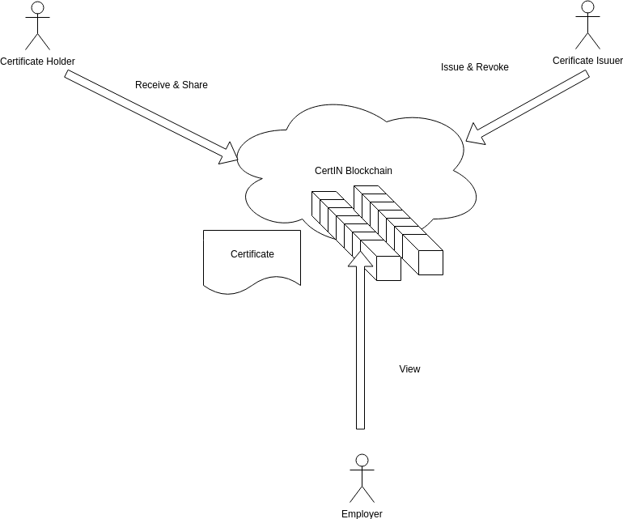

# CertIN Blockchain
CertIN is a blockchain project for handling certificates that will allow the following basic primitive functionalities over Hyperledger Fabric:  
1- Certificate issuers can issue and revoke certificates.
 
2- Certificate holders can receive and share certificates.
 
3- Employers can view the certificates, and verify the authenticity.

 

# Project development phases
The certificates in this project are encoded with some encoder; and the data is put in the body of the certificate model; rendering of the certificate is solely a client side problem.
 
Registrar identities are responsible for registering certificate issuers who enroll the certificate holders which perform the interactions over the network.
 

# Key value
All users of this application will mainly rely on client side (on browser) SDK's to connect to the network securely via their identity cards which holds their credentials /or users can access the network via REST-SERVER supported by their respective organizations; all information over this network is auditable and verifiable by the emerging blockchain technology.